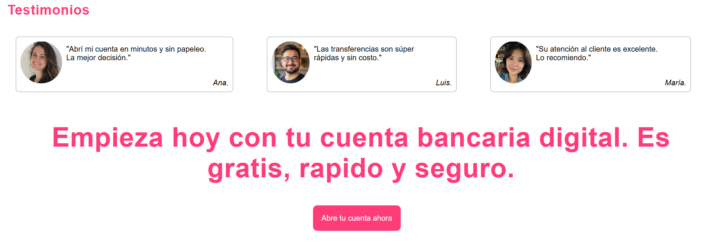

# Landing Page - Pirate Bank
Esta es una landing page ficticia para un banco pirata, creada con fines educativos. Su objetivo es promocionar la apertura de una cuenta en el banco. Incluye informacion de los beneficios, testimonios de usuarios y llamados a la acción (CTA). 

# Objetivo
esta landing page fue creada como practica
para reforzar mis conocimientos con HTML y CSS.

# Tecnologias Utilizadas 
* HTML
* CSS
* Git
* GitHub

# Componentes Principales 
* __Navbar:__ contiene el logo y enlaces a las secciones.
* __Hero:__ Seccion principal con titulo, subtitulo e invitación a la acción (CTA).
* __Seccion de beneficios:__ incluye cinco columnas con iconos y texto acompañadas de una imagen a lado.
* __Testimonios:__ tarjetas de opiniones.

* __Frase presuasiva__  acompañada de un boton CTA.
* __Footer:__  contiene direccion, correo electronico y aviso legal.

# Capturas de pantalla
Vista del hero y navegación:

Vista de la seccion de testimonios:

